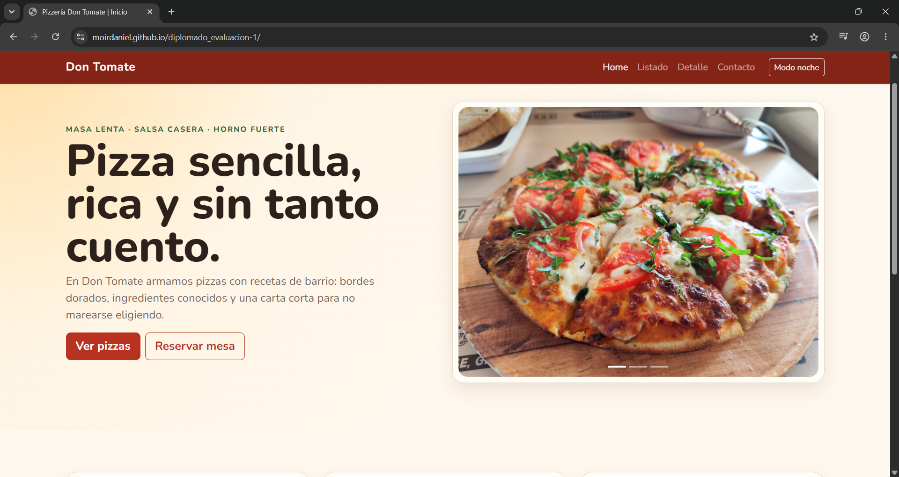
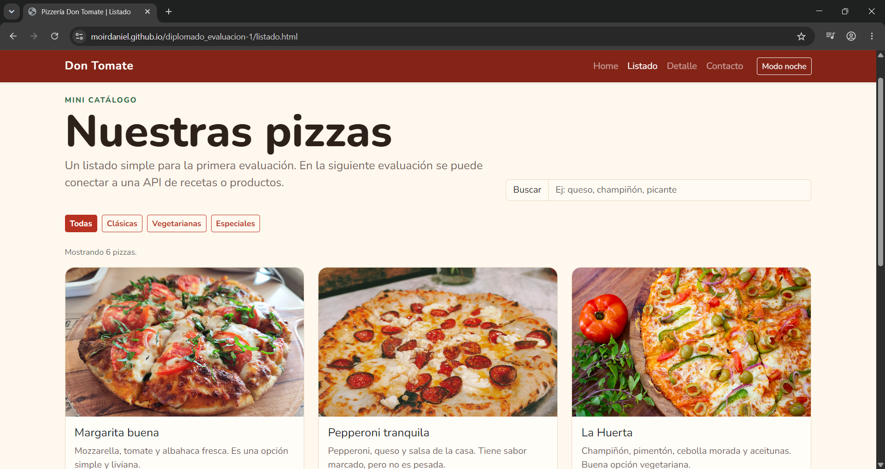
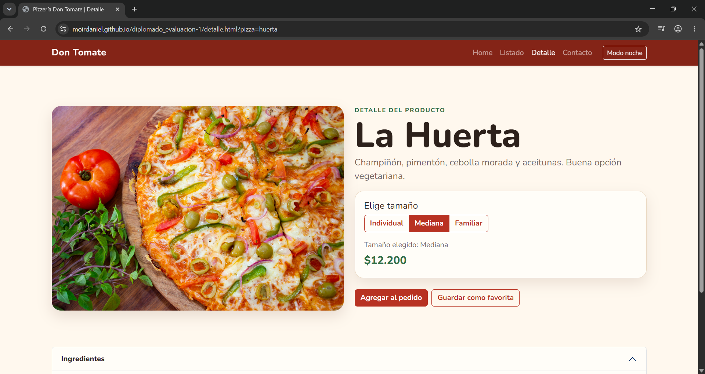
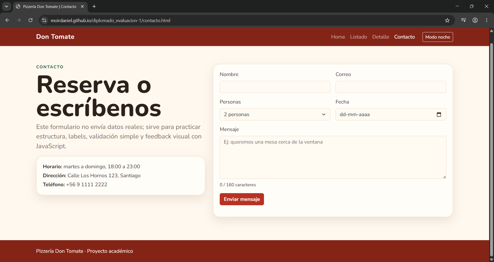

# Pizzería Don Tomate

> Proyecto del Módulo 1 - HTML + CSS + JS · Diplomado Fullstack IPSS

## Integrantes

- Daniel Moir
- Rosió Leuquén

## Descripción

Pizzería Don Tomate es un mini-catálogo ficticio de pizzas de barrio. 
El sitio usa la Opción B de la evaluación: Home, Listado, Detalle y Contacto.

La idea visual es sencilla y cercana, con colores cálidos, tarjetas de productos, formulario de contacto y pequeñas interacciones hechas con JavaScript.

## Demo

- Sitio desplegado: https://moirdaniel.github.io/diplomado_evaluacion-1/

### Capturas

- Home



- Home - modo oscuro


- Listado



- Detalle



- Contacto



## Cómo correr localmente

```bash
git clone [URL_DEL_REPOSITORIO]
cd diplomado_evaluacion-1
# abrir index.html en el navegador
```

También se puede usar un servidor local:

```bash
python -m http.server 8000
```

Luego abrir:

```text
http://localhost:8000
```

## Estructura del proyecto

```text
.
├── index.html
├── listado.html
├── detalle.html
├── contacto.html
├── README.md
├── css/
│   └── custom.css
├── js/
│   └── main.js
├── img/
└── docs/
    ├── home.png
    ├── home-dark.png
    ├── listado.png
    ├── detalle.png
    └── contacto.png
```

## Stack

- HTML5 semántico
- Bootstrap 5 vía CDN
- CSS custom propio
- JavaScript

## Componentes Bootstrap usados

- Navbar responsive
- Carousel en Home
- Cards en Home y Listado
- Input group en Listado
- Accordion y Modal en Detalle
- Formulario en Contacto

## Interacciones JavaScript propias

- Botón de modo día/noche.
- Filtro y búsqueda de pizzas en el listado.
- Cambio de tamaño/precio en detalle.
- Guardar pizza favorita.
- Contador de caracteres y validación simple del formulario.
